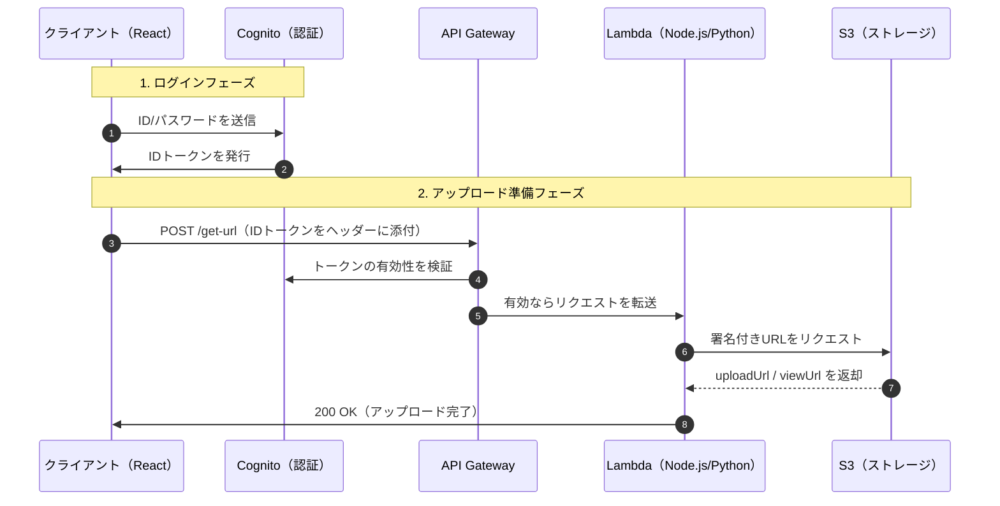

# S3 Secure Upload API仕様書 (v1.0)
このドキュメントは、外部システムからセキュアにS3へファイルをアップロードするためのインターフェース（I/F）定義書です。

## 1. 概要
本APIは、AWS Cognitoによる認証を経て、S3への署名付きURL（Pre-signed URL）を発行します。
利用者は取得したURLを使用して、直接ストレージへデータを送信します。

## 2. エンドポイント
* ベースURL: https://xxxxxxxx.execute-api.ap-northeast-3.amazonaws.com/prod
* プロトコル: HTTPS(TLS 1.2以上)

## 3. 認証(Authentication)
全ての定義済みリクエストには、HTTPヘッダーに**Cognite IDトークン**を含める必要があります。

|ヘッダー名|値|内容|
|:---|:---|:---|
|Authorization|Bearer <ID_TOKEN>|Cogniteで取得した有効なトークン|

## 4. API定義
### 4.1 アップロードURL発行
アップロード用と閲覧用の署名付きURLを取得します。
* メソッド: POST
* パス: /get-s3-upload-url

**リクエストボディ(JSON)**
|項目名|型|必須|説明|
|:---|:---|:---|:---|
|fileName|string|◯|アップロードするファイル名(拡張子含む)|

**レスポンス(Success 200)**
```JSON
{
  "uploadUrl": "https://s3.ap-northeast-3.amazonaws.com/...",
  "viewUrl": "https://s3.ap-northeast-3.amazonaws.com/...",
}
```

**エラーレスポンス(Error)**
|ステータス|原因|
|:---|:---|
|401 Unauthorized|トークンが未設定または有効期限切れ|
|403 Forbidden|権限不足|
|500 Internal Server Error|サーバー側処理失敗|

## 5. シーケンス図
1. **[Client]** -> Cognite でログインし、トークンを取得。
2. **[Client]** -> 本API(POSTにトークンを添えてリクエスト。
3. **[API Gateway]** -> Cognite と連携してトークンを検証。
4. **[Lambda]** -> S3署名付きURLを生成し返却。
5. **[Client]** -> 取得したuploadUrlに対してPUTリクエストでファイルを送信。

